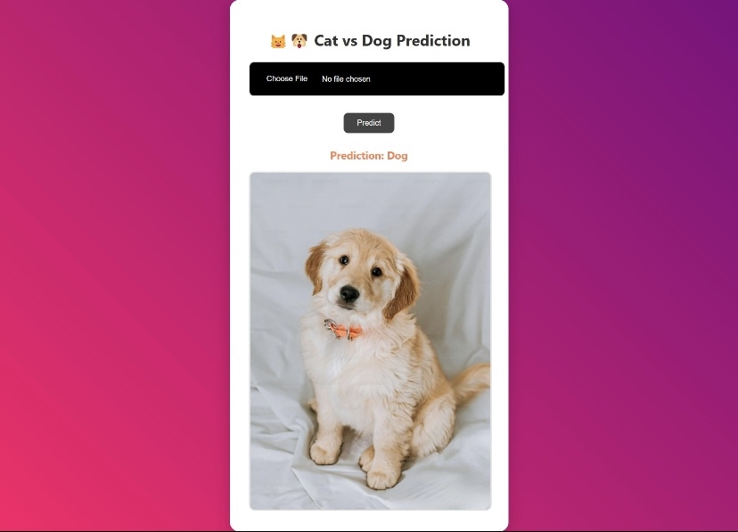
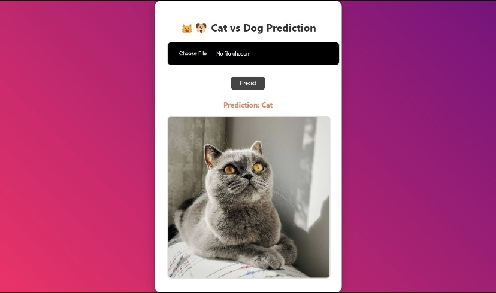
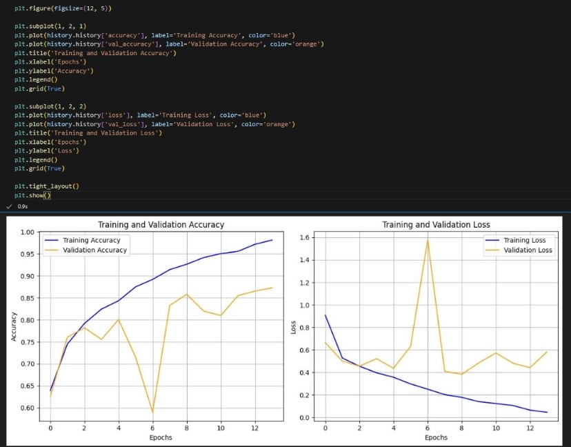

# 🐶 Dog vs Cat Classifier Using Convolutional Neural Networks (CNN)

A **deep learning project** that classifies images of **dogs and cats** using a **Convolutional Neural Network (CNN)**.  
The model is trained to accurately distinguish between the two classes and provides predictions through a simple user interface.

---

## 🎯 Features

- 🧠 **CNN-based image classification** (Dog vs Cat)
- 🖼️ Image preprocessing (resizing & normalization)
- 🔁 **Data augmentation** to improve generalization
- 🧯 **Dropout layers** to prevent overfitting
- 📈 Hyperparameter tuning for better accuracy
- 📤 Frontend interface for image upload & prediction

---

## 🖼️ Visuals

### Home Page – Image Upload
📸 Upload an image to classify whether it is a dog or a cat  

### Dog Prediction
📸 Model correctly predicts a **Dog** image  

### Cat Prediction
📸 Model correctly predicts a **Cat** image  

### Training Performance
📸 Training vs Validation **Accuracy & Loss** graph  

---

## 📊 Model Performance

- **Training Accuracy:** 92%  
- **Validation Accuracy:** 90%  
- **Loss:** 0.22  

---

## 🧠 Tech Stack

- **Language:** Python  
- **Deep Learning:** TensorFlow / Keras  
- **Model:** Convolutional Neural Network (CNN)  
- **Frontend:** HTML, CSS  
- **Libraries:** NumPy, Matplotlib, OpenCV  

---

## 📚 Learning Outcomes

- Strong understanding of **CNN architectures**
- Practical experience with **image classification**
- Learned to handle **overfitting** using dropout & augmentation
- Visualized training performance using accuracy & loss graphs
- Gained confidence in deploying deep learning models

---

## 🚀 About

This project strengthened my foundation in **Deep Learning and Computer Vision** and motivated me to build more advanced AI-powered applications.
